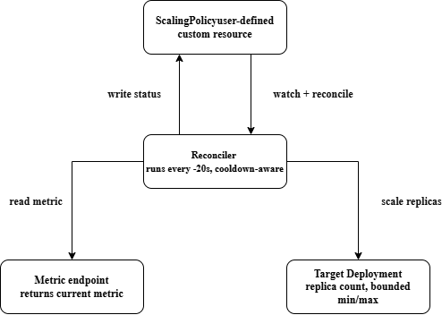

# Kubernetes Custom Metrics Autoscaler

> Status: In Progress — just started. This README is updated as the
> project develops. See `PROGRESS.md` for the detailed build log and
> `PROBLEM_STATEMENT.md` for the full scope and motivation.

## Overview
 
A Kubernetes Operator, written in Go, that scales application pods based on
a custom-defined metric — instead of only CPU/memory like the default
Kubernetes Horizontal Pod Autoscaler. It reads a metric from any HTTP
endpoint, compares it against configurable thresholds, and scales a target
Deployment's replica count up or down, within safety bounds
(`minReplicas`/`maxReplicas`) and with a cooldown to prevent flapping.
 
Verified end-to-end on a local Minikube cluster: given a metric above the
scale-up threshold, the operator scaled a demo Deployment from 1 to 5
replicas over five reconcile cycles, correctly stopping at `maxReplicas`.
Given a metric below the scale-down threshold, it scaled back down from 5
to 1, correctly stopping at `minReplicas`. See Results below for details.

## Motivation
 
The default Kubernetes autoscaler only understands CPU and memory, but in
real systems the signal that actually reflects load — a queue backlog,
active sessions, request latency — often isn't visible in resource usage
at all. This project builds a minimal version of the underlying mechanism
(CRD, controller, reconciliation loop) that tools like KEDA and the
Kubernetes Custom Metrics API solve at production scale, in order to
understand it deeply rather than use it as a black box. Full motivation
in `PROBLEM_STATEMENT.md`.

## Architecture
 
A `ScalingPolicy` custom resource declares the desired behavior: which
Deployment to scale, where to read the metric from, the scale-up/down
thresholds, and the replica bounds. The reconciler watches for
`ScalingPolicy` objects and, on a ~20-second loop, reads the metric,
decides whether to scale up or down by one replica, applies that change
to the target Deployment (bounded by `minReplicas`/`maxReplicas`), and
writes the result back to the `ScalingPolicy`'s status.


 
[Architecture diagram shown above]

## Tech Stack

- Go
- Kubernetes (`client-go`, `controller-runtime`)
- Docker
- Prometheus (planned, for metrics exposure)
- Minikube / Kind (local test cluster)

## Project Structure

```
Kubernetes-Operator/
├── cmd/
│   └── manager/              # main.go — entrypoint for the operator binary
├── api/
│   └── v1alpha1/             # CRD type definitions (ScalingPolicy)
├── controllers/              # Reconciliation loop logic
├── config/
│   ├── crd/                  # Generated CRD YAML manifests
│   ├── rbac/                 # RBAC permissions for the operator
│   ├── manager/              # Deployment manifest for the operator itself
│   └── samples/              # Example ScalingPolicy YAML resources
├── docs/                     # Diagrams, design notes
├── test/                     # Test scenarios / load-spike simulation scripts
├── hack/                     # Dev scripts (local cluster setup, etc.)
├── Dockerfile
├── Makefile
├── go.mod
├── PROBLEM_STATEMENT.md      # What problem this solves and why
├── PROGRESS.md               # Phased build log, updated as we go
└── README.md                 # This file
```

## Getting Started
 
Prerequisites: Go 1.27+, Docker Desktop, Minikube, kubectl.
 
```bash
minikube start --driver=docker
docker build -t k8s-custom-autoscaler:dev .
minikube image load k8s-custom-autoscaler:dev
 
kubectl apply -f config/crd/scalingpolicy-crd.yaml
kubectl apply -f config/rbac/rbac.yaml
kubectl apply -f config/manager/deployment.yaml
 
kubectl get pods   # scalingpolicy-operator should show 1/1 Running
```
 
## Usage & Testing
 
```bash
kubectl apply -f config/samples/target-deployment.yaml
kubectl apply -f config/samples/mock-metric-server.yaml
kubectl apply -f config/samples/demo-scalingpolicy.yaml
 
kubectl get deployment demo-app -w
```

To trigger a scale-down, edit the metric value in
`config/samples/mock-metric-server.yaml` to something below
`scaleDownThreshold`, re-apply, and restart the mock server pod
(`kubectl delete pod -l app=mock-metric-server`) so it picks up the new
value immediately rather than waiting for the ConfigMap sync interval.
 
Unit tests for the scaling decision logic:
```bash
go test ./controllers/... -v
```

## Results
 
- **Scale-up**: mock metric set to 150 (`scaleUpThreshold: 100`). Operator
  scaled the target Deployment from 1 to 5 replicas over 5 reconcile
  cycles (~20s apart), correctly holding at `maxReplicas: 5` despite the
  metric still exceeding the threshold.
- **Scale-down**: mock metric set to 5 (`scaleDownThreshold: 20`).
  Operator scaled back down from 5 to 1 replicas over 4 reconcile cycles,
  correctly holding at `minReplicas: 1`.
- **Unit tests**: 6/6 passing, covering scale-up, scale-down, no-op
  within normal range, and boundary enforcement at both `MinReplicas`
  and `MaxReplicas` under extreme metric values.
- Full dated log with exact commands and timestamps in `PROGRESS.md`.

## What I Learned

- Custom Kubernetes types must implement `DeepCopyObject()` to satisfy
  the `client.Object` interface — normally auto-generated by
  `controller-gen`, implemented by hand here to understand what it does.
- A `scheme.Builder` must have `.Register()` called explicitly on it;
  creating the builder alone registers zero types. This caused a real
  startup crash (`no kind is registered for the type ...`), fixed by
  adding the missing `SchemeBuilder.Register()` call.
- Scaling by ±1 replica per cycle, re-checked on a fixed interval, is a
  more conservative and production-realistic pattern than jumping to a
  computed "ideal" replica count from a single metric reading — similar
  in spirit to how Kubernetes' own HPA dampens scaling decisions.
- `go.sum` must be copied into a Docker build context alongside
  `go.mod`; without it, every dependency fails with "missing go.sum
  entry" at compile time even though `go mod download` succeeds.
- ConfigMap-mounted files inside a running pod don't update instantly —
  kubelet syncs them on a periodic interval. Restarting the pod forces
  an immediate pickup of the new value, useful for testing.

-----

## Limitations & Non-Goals
 
See `PROBLEM_STATEMENT.md` for the full list. Short version: this is a
learning project run on a local cluster, not a production system, and is
not a replacement for tools like KEDA.